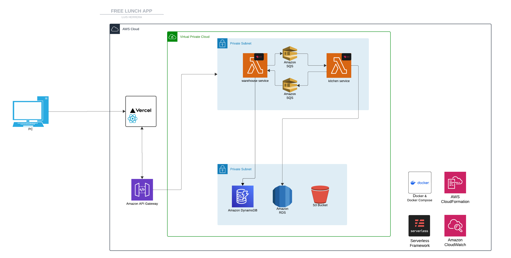

# 🍽️ Sistema de Donacion de Comida - Restaurante

## 📑 Tabla de Contenidos

1. [🎯 Introduccion](#introduccion)
2. [📋 Requisitos Previos](#requisitos-previos)
3. [⚙️ Instalacion](#instalacion)
4. [🔧 Configuracion](#configuracion)
5. [🐳 Ejecucion del Proyecto con Docker](#ejecucion-del-proyecto-con-docker)
6. [💻 Ejecucion Local](#ejecucion-local)
7. [🛠️ Comandos de Desarrollo](#comandos-de-desarrollo)
8. [🏗️ Arquitectura](#arquitectura)
9. [🤝 Contribuciones](#contribuciones)
10. [📄 Licencia](#licencia)
11. [👨‍💻 Autor](#autor)

---

## 🎯 Introduccion

Este proyecto implementa un sistema para gestionar la donacion de platos de comida en un restaurante. El sistema consta de dos microservicios desplegados como funciones Lambda:

1. **🍳 Kitchen Service**: Maneja la preparacion de platos y está conectado a una base de datos PostgreSQL para gestionar los platos disponibles y su estado.
2. **🏪 Warehouse Service**: Maneja la gestion de ingredientes en bodega, conectándose a una base de datos DynamoDB.

Ambos servicios reciben solicitudes a través de API Gateway y se comunican entre sí utilizando Amazon SQS para garantizar un flujo eficiente de datos.

---

## 📋 Tecnologías Utilizadas

### Backend y Framework
-  Framework Node.js para construcción de aplicaciones escalables
-  Entorno de ejecución
-  Gestor de paquetes

### Infraestructura y Despliegue
-  Framework para desarrollo y despliegue serverless
-  SDK para interacción con servicios AWS
-  Containerización de aplicaciones
-  Orquestación de contenedores
-  Emulación de servicios AWS localmente
-  Infraestructura como código

### Servicios AWS
-  Gestión y exposición de APIs
-  Funciones serverless
-  Cola de mensajes para comunicación entre servicios
-  Almacenamiento de objetos

### Bases de Datos
-  Base de datos relacional para Kitchen Service
-  Base de datos NoSQL para Warehouse Service

---

## 📋 Requisitos Previos

Antes de iniciar, asegúrate de tener instalado:

- **📦 Node.js** (version 16 o superior)
- **🐳 Docker** y **Docker Compose**
- **☁️ Serverless Framework** (`npm install -g serverless`)
- **🔑 AWS CLI** configurado con credenciales adecuadas
- **🐘 PostgreSQL** configurado o con un contenedor Docker
- **📊 DynamoDB** local o configurado en AWS

---

## ⚙️ Instalacion

1. Clona este repositorio:

```bash
git clone https://github.com/tu-usuario/free-lunch-api.git
cd free-lunch-api
```
2. Instala las dependencias:

```bash
npm install
```
---

## 🐳 Ejecucion del Proyecto con Docker

1. Construye las imágenes:

```bash
docker-compose build
```
2. Inicia los servicios:

```bash
docker-compose up -d
```

3. Verifica los logs:

```bash
docker-compose logs -f
```

4. Detener los servicios:
```bash
docker-compose down
```

---

## 💻 Ejecucion Local

1. Inicia el servicio de Kitchen:

```bash
cd kitchen
npm run start:dev
```
2. En otra terminal, inicia el servicio de Warehouse:

```bash
cd warehouse
npm run start:dev
```
3. Los servicios estarán disponibles en:
- 🍳 Kitchen Service: http://localhost:3000
- 🏪 Warehouse Service: http://localhost:3001

---

## 🛠️ Comandos de Desarrollo

### 🔍 Linting y Formateo

```bash
# Ejecutar ESLint
npm run lint

# Corregir problemas de linting automáticamente
npm run lint:fix

# Formatear código con Prettier
npm run format
```

### 🚀 Despliegue

```bash
# Desplegar todos los servicios
npm run sls:deploy

# Desplegar un servicio específico
cd kitchen && npx serverless deploy
# o
cd warehouse && npx serverless deploy
```

---

## 🏗️ Arquitectura

### 📊 Diagrama de Infraestructura


El diagrama muestra la arquitectura del sistema, incluyendo:
- 🌐 API Gateway como punto de entrada
- ⚡ Funciones Lambda para cada microservicio
- 💾 Bases de datos PostgreSQL y DynamoDB
- 📨 Cola SQS para comunicación entre servicios
- 🔒 Configuración de VPC y Security Groups

---

## 🤝 Contribuciones

Las contribuciones son bienvenidas. Por favor, sigue estos pasos:

1. 🍴 Fork el repositorio
2. 🌿 Crea una rama para tu feature (`git checkout -b feature/AmazingFeature`)
3. 💾 Commit tus cambios (`git commit -m 'Add some AmazingFeature'`)
4. 📤 Push a la rama (`git push origin feature/AmazingFeature`)
5. 📬 Abre un Pull Request

---

## 📄 Licencia

Este proyecto está bajo la Licencia MIT - ver el archivo [LICENSE.md](LICENSE.md) para más detalles.

---

## 👨💻 Autor

Luis Felipe Herrera Cardenas - [LinkedIn](https://www.linkedin.com/in/luis-herrera-cárdenas/)
